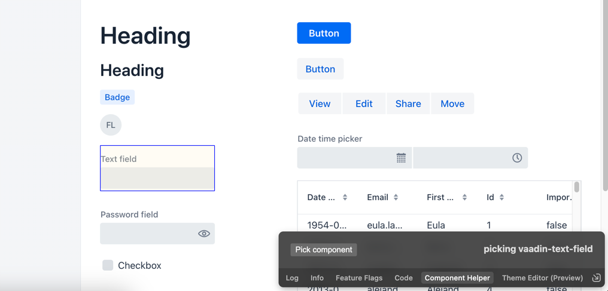
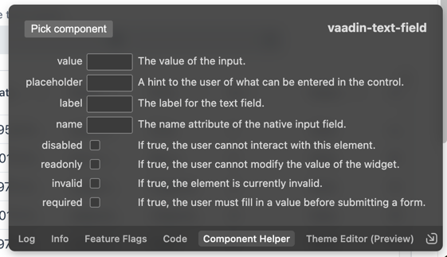
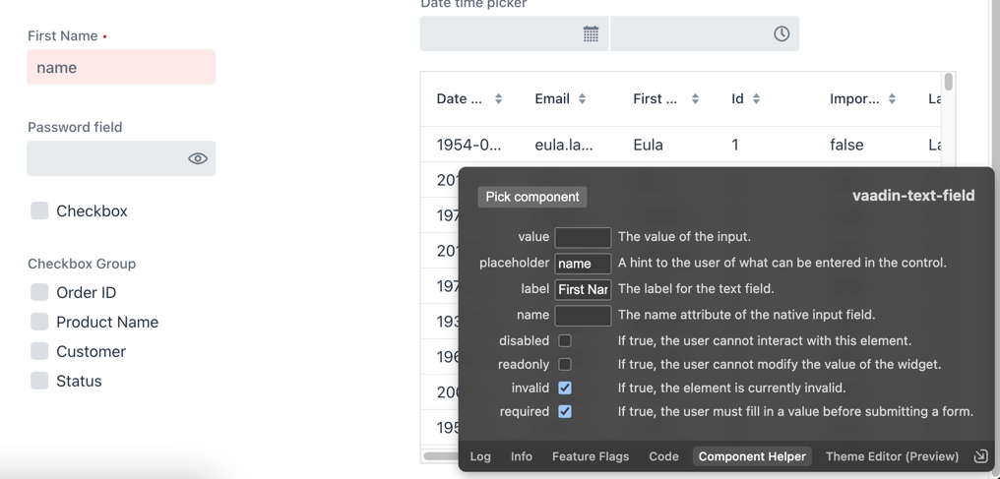
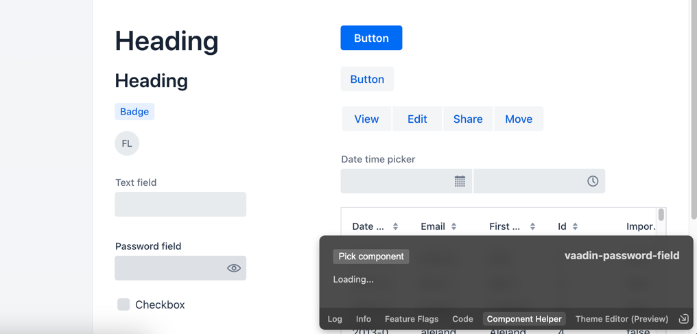
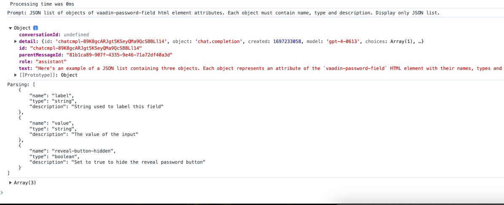
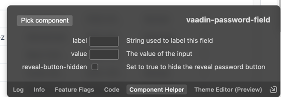
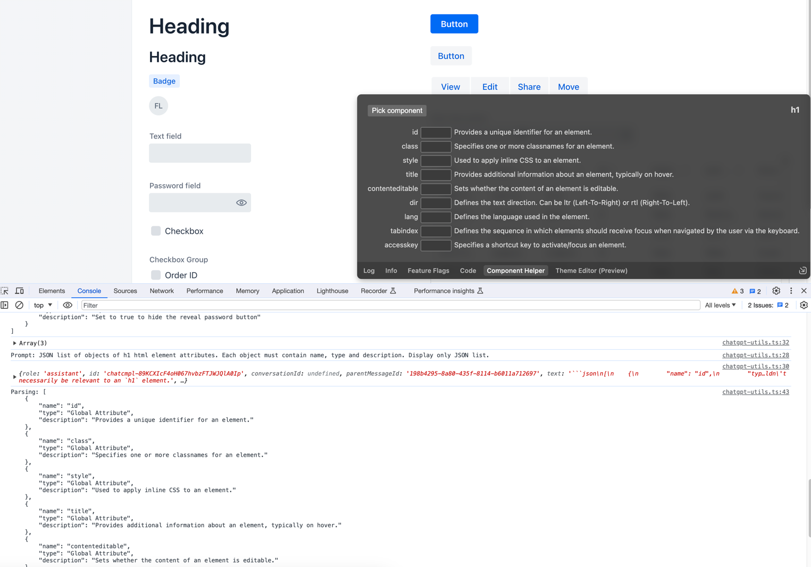
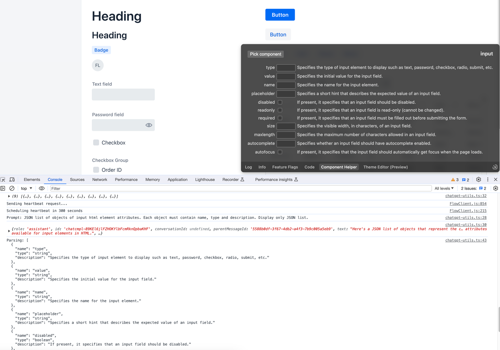
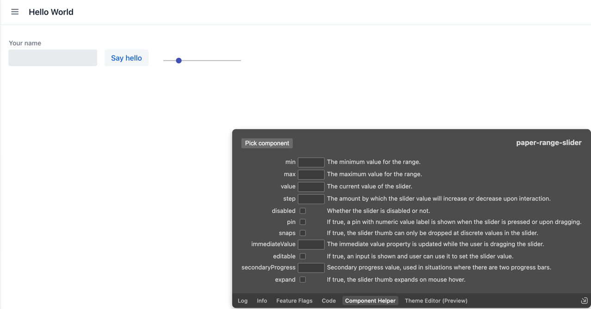

# Component Helper - Hackathon 24.2

This project uses dev-tools-plugin feature together with ChatGPT to get information about available component attributes and allow simple modifications (string and booleans only).

Supports all HTML elements. Examples for Vaadin components, native HTML components and 3rd party Web Components below.

ChatGPT is optional as response has been cached for few components, see details below.

## ChatGPT API key (optional)

Set your ChatGPT API key within `./frontend/component-helper/chatgpt-utils.ts` as `const apiKey = 'sk-xxxxxxxxxx';`

## Running the application

As usual: `mvn`.

## Component Helper

### Picking cached components

Use `Pick component` to select component, start with vaadin-text-field.

vaadin-text-field and vaadin-button have cached ChatGPT response so you will see available attributes, inputs and descriptions immediately:

Modify values and see instant preview:

### Picking non-cached Vaadin components

After picking any other component, ChatGPT request will be send. You will see loading indicator:

In browser console logs you will processing and parsing info:

After that processed fields will be rendered automatically:

### Non Vaadin components

It is possible to pick ANY component but results can be totally unpredictable ;-) Few examples:

#### H1

#### input

#### paper-range-slider

